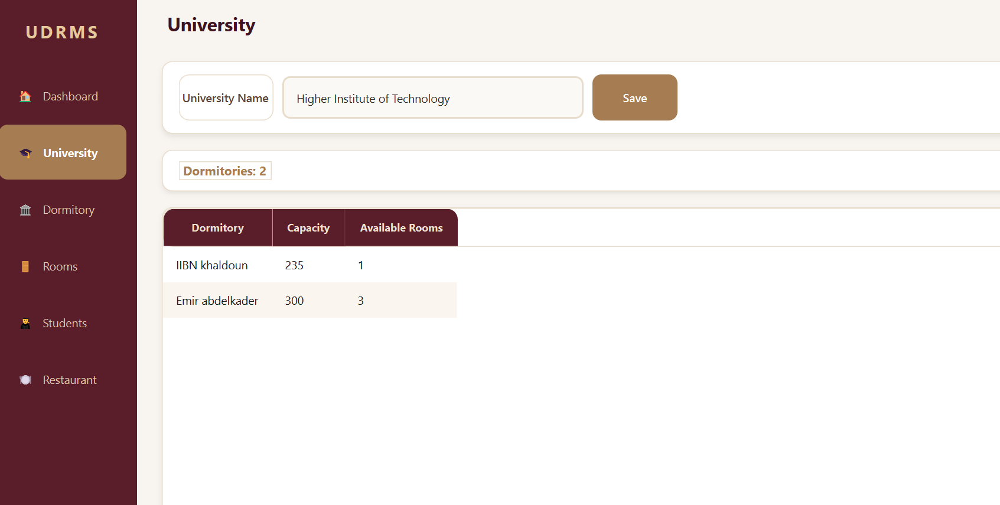
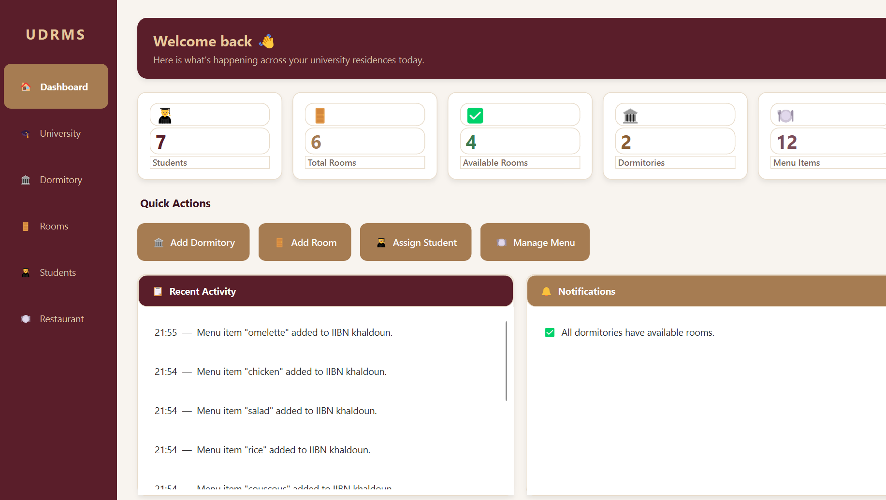
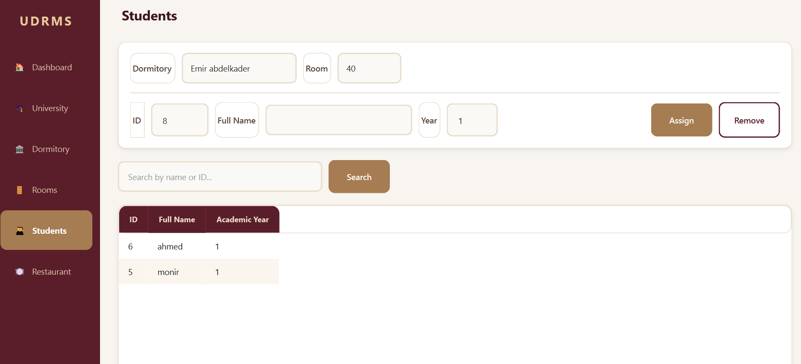
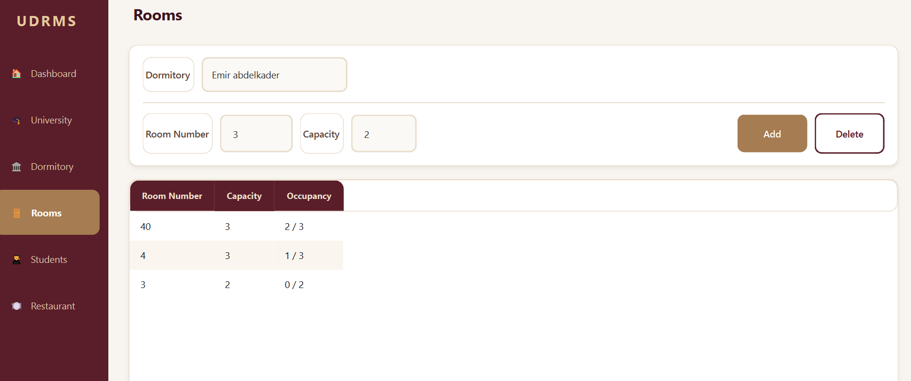
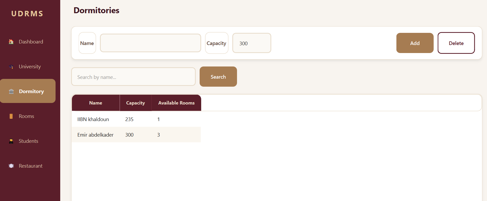
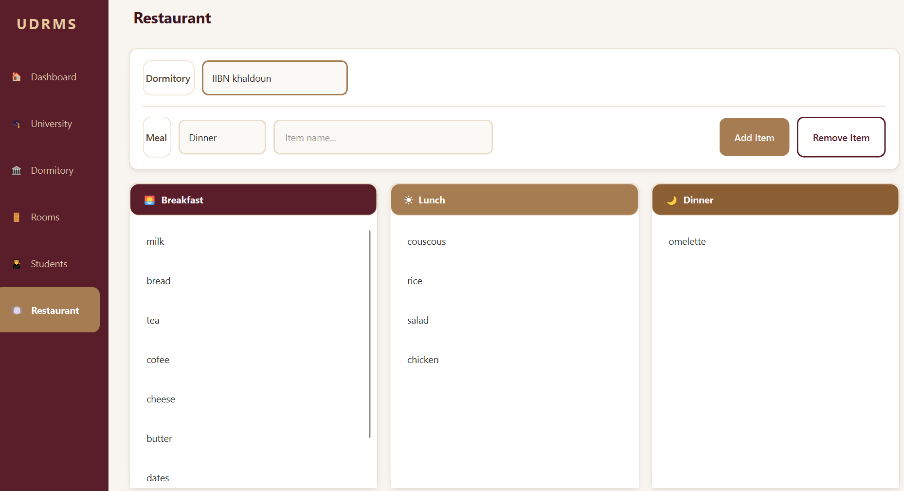

# University Dormitory & Restaurant Management System

This project is developed using C++ and Qt Framework.

## Project Idea
A management system for university dormitory and restaurant including:
- Student management
- Room reservation system
- Restaurant services
- Dashboard interface

##  Technologies Used
- C++
- Qt Framework
- Object-Oriented Programming (OOP)

## Features
- Modern Dashboard UI
- Student management system
- Room management
- Restaurant module
- Clean and organized interface

## Interface
Screenshots of the application are available in the `/screenshots` folder.

## How to Run
1. Open the `.pro` file in Qt Creator
2. Configure the project
3. Build and run

## Note
This project follows OOP principles such as:
- Inheritance
- Polymorphism
- Encapsulation
##  Screenshots

### University / Home

### Main System

### Students

### Rooms

### Dormitories

### Restaurant

